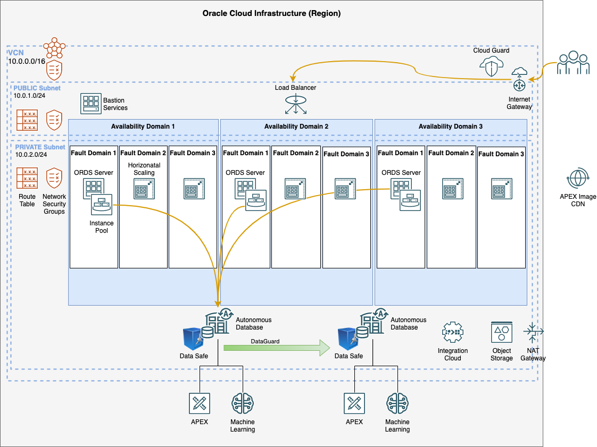

# oci-arch-apex-ords
 

Oracle Cloud Infrastructure (OCI) APEX Application using Customer Managed ORDS

## Release Info
* **TAG: 1.0.0** - Uses mTLS for connecting ORDS to the ADB; Terraform Provisioner and Bastion Services to stage ADB wallet and ORDS Config
* **MAIN:** Uses TLS for connecting ORDS to the ADB, eliminating the wallet and Bastion; cloud-init replaces Provisioner to configure ORDS

**UPDATE**: In September 2021, Oracle [announced](https://blogs.oracle.com/apex/post/introducing-vanity-urls-on-adb) suppport for Vanity URLs for OCI ADBs without the need for Customer Managed ORDS front-end.  This new feature is not applicable to Always Free resources as explained in the [FAQS](FAQS.md).  For Paid Tenancies, an IaC taking advantage of this new feature can be found here:[oci-arch-apex-vanity](https://github.com/gotsysdba/oci-arch-apex-vanity)

## Architecture
This Terraform IaC supports 4 different size configurations as defined in vars.tf: ALF (Always Free), S, M, L with variations to the general architecture.  Review the "Setup Environment Variables" below for instructions on how to set the appropriate size (**default:** ALF).

|                              | ALF   | XS    | S     | M    | L    | 
| ---------------------------- | ----- | ----- | ----- | ---- | ---- |
| **Compute Instances (CI)**   | 1     | 1     | 1     | 2    | 3    | 
| **CI Horizontal Scale**      | 1     | 1     | 3     | 6    | 9    |
| **CI CPU Initial**           | 1     | 1     | 1     | 2    | 4    |
| **CI CPU Vertical Scale**    | 1     | 1     | 2     | 4    | 8    |
| **CI Memory Initial**        | 1     | 1     | 16    | 32   | 64   |
| **CI Memory Scale**          | N/A   | N/A   | 32    | 64   | 192  |
| **ADB CPU Initial**          | 1     | 1     | 1     | 2    | 4    |
| **ADB CPU Scale**            | N/A   | N/A   | 3     | 6    | 12   |
| **ADB Storage (TB)**         | 1     | 1     | 1     | 1    | 1    |
| **Load Balancer (Mbps Min)** | 10    | 10    | 10    | 100  | 100  |
| **Load Balancer (Mbps Max)** | 10    | 10    | 480   | 1250 | 1250 |
| **High Availability**        | FALSE | FALSE | FALSE | TRUE | TRUE |
| **Disaster Recovery**        | FALSE | FALSE | FALSE | TRUE | TRUE |
| **Dataguard**                | FALSE | FALSE | FALSE | TRUE | TRUE |

<mark>Always Free Notice:</mark> This architecture for Always Free utilises most of the Always Free resources; it is expected that your tenancy does not have anything provisioned otherwise deployment will fail with limit issues.

### L Architecture Diagram


* [Other Sizes Architecture Diagrams](ARCHITECTURE.md)
* [Architecture Details](ARCHITECTURE_DETAILS.md)

## Assumptions
* An existing OCI tenancy; either Paid or Always Free

## Load Balancer Certificates
Example self-signed certificates are created by terraform for testing purposes only and should not be used for Production.  Update the Load Balancer in the OCI console with real certificates; or utilise LetsEncrypt/CertBot as documented in the [oci-lbaas-letsencrypt repository](https://github.com/gotsysdba/oci-lbaas-letsencrypt)

## Architecture Deployment 
There are three main ways to deploy this Architecture:
- Resource Manager
- Cloud Shell
- Terraform Client (Advanced)

### **Resource Manager**
Deploy this Stack using OCI Resource Manager:

[![Deploy to Oracle Cloud][magic_button]][magic_arch_stack]

### **Cloud Shell**
Using [Cloud Shell](https://docs.oracle.com/en-us/iaas/Content/API/Concepts/cloudshellintro.htm) is, by far, the easiest way to manually install this Architecture.

1. Log into your tenancy and launch Cloud Shell
2. Clone this repository: `git clone https://github.com/gotsysdba/oci-arch-apex-ords.git`
3. `cd oci-arch-apex-ords`
4. `source ./terraform-env.sh`
5. To install into a specific compartment, change the TF_VAR_compartment_ocid variable (default root)
   - `export TF_VAR_compartment_ocid=ocid1.compartment....e7e5q`
6. To change the Architecture Size, change the TF_VAR_size variable (default ALF)
   - `export TF_VAR_size=<ALF|S|M|L>`
7. Deploy!
   - `terraform init`
   - `terraform apply`

### **Terraform Client**
#### **Setup Environment Variables**
Update the [terraform-env.sh](terraform-env.sh) file. 

You'll need to update three fields with values you can find in the [OCI console](https://cloud.oracle.com/):

* TF_VAR_compartment_ocid
* TF_VAR_tenancy_ocid
* TF_VAR_current_user_ocid

To change the default ALF (Always Free) sizing, manaully set TF_VAR_size to either S, M, or L; for example:

```
export TF_VAR_size=S
```

When you've set all the variables, source the file with the command `source ./terraform-env.sh` or you could stick the contents of the file in `~/.bash_profile`:
```
source ./terraform-env.sh
```

Use the command `env | grep TF` to see the variables set by the environment file. It should look something like the following:
```
env | grep TF
TF_VAR_tenancy_ocid=ocid1.tenancy....zhi3q
TF_VAR_compartment_ocid=ocid1.compartment....e7e5q
TF_VAR_region=us-ashburn-1
TF_VAR_fingerprint=50:d0:7d:f7:0e:05:cd:87:3b:2a:cb:50:b1:17:90:e9
TF_VAR_api_private_key_path=~/.oci/oci_api_key.pem
TF_VAR_current_user_ocid=ocid1.user....ewc5a
```

It is recommended to utilise [Terraform Workspaces](https://www.terraform.io/docs/language/state/workspaces.html) for each sized deployment due to tfstate files.

#### **Install Terraform**
Instructions on installing Terraform are [here](https://www.terraform.io/intro/getting-started/install.html).  The manual, pre-compiled binary installation is quickest way to start using Terraform.

You can test that the install was successful by running the command:
    terraform

You should see usage information returned.

#### **Always Free Only - Install OCI CLI**
The Always Free deployment requires the installation of the OCI CLI Client as documented [here](https://docs.oracle.com/en-us/iaas/Content/API/SDKDocs/cliinstall.htm).  For more information as to why, please review the [Frequently Asked Questions](FAQS.md).  

#### **Build the Architecture**
Once the environment has been setup.  Run the following to build the infrastructure:

```
terraform init
terraform plan
terraform apply
```

## Accessing APEX (Web)
After the `terraform apply` has completed, it will output the Load Balancers IPAddress such as:
```
lb_address = tolist([
  "129.159.249.211",
])
```

You can also look up the Load Balancer IP via the OCI Console.
Placing that IPAddress in a web browser will redirect you to the secure APEX port and prompt for the ADB's ADMIN password.  The ADMIN password was randomised during provisioning and is unknown.  Reset it in the OCI console to login.

# FAQs
[Frequently Asked Questions](FAQS.md)

[magic_button]: https://oci-resourcemanager-plugin.plugins.oci.oraclecloud.com/latest/deploy-to-oracle-cloud.svg
[magic_arch_stack]: https://cloud.oracle.com/resourcemanager/stacks/create?zipUrl=https://github.com/gotsysdba/oci-arch-apex-ords/oci-arch-apex-ords.zip
